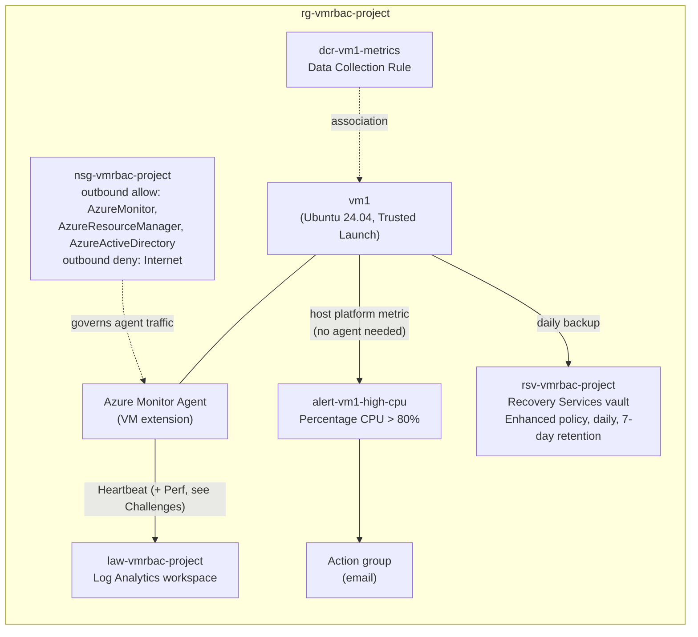

# Monitoring, Backup & Recovery (Project 3 of 6)

Hands-on Azure lab built for AZ-104 (Microsoft Azure Administrator) preparation. It adds monitoring and backup to the VM environment from Projects 1 and 2: a Log Analytics workspace fed by the Azure Monitor Agent through a Data Collection Rule, a host-level CPU alert rule, a KQL query that surfaces an operational signal, and Azure Backup with a Recovery Services vault, a backup policy, and a confirmed restore point. The monitoring resources are defined in Bicep.

> Related repos: [VM-RBAC-Config](https://github.com/waynethedon/VM-RBAC-Config) (Project 1) · [VNet-Storage-Config](https://github.com/waynethedon/VNet-Storage-Config) (Project 2) · [Entra-Identity-Config](https://github.com/waynethedon/Entra-Identity-Config) (Project 4) · [AppService-Config](https://github.com/waynethedon/AppService-Config) (Project 5) · [Storage-Recovery-Config](https://github.com/waynethedon/Storage-Recovery-Config) (Project 6)

> **Status:** the lab environment was torn down in October 2026 when the Azure free trial ended. This repo is kept as documentation of the build.

---

## Architecture



Monitoring and backup are separate pipelines protecting the same VM. The Log Analytics workspace stores telemetry, the Recovery Services vault stores backup data, and neither feeds into the other. The CPU alert is a third, independent path: it uses a metric the Azure host collects, so it works even if the agent is down.

- **Log Analytics workspace:** `law-vmrbac-project` (North Central US)
- **Azure Monitor Agent (AMA):** installed on `vm1` as a VM extension, deployed with Bicep
- **Data Collection Rule:** `dcr-vm1-metrics`, collecting the guest counter `\Processor(_Total)\% Processor Time` every 60 seconds into the `Microsoft-Perf` stream, sent to the workspace
- **Data Collection Rule association:** links the DCR to `vm1`
- **CPU alert rule:** `alert-vm1-high-cpu`, a metric alert on the host-level `Percentage CPU` metric (> 80% over a 5-minute window), notifying an action group by email
- **KQL query:** gap detection on the `Heartbeat` table (see [KQL query](#kql-query))
- **Recovery Services vault:** `rsv-vmrbac-project` (North Central US), Enhanced backup policy, daily backup, 7-day retention
- **Infrastructure as Code:** the AMA extension, DCR, DCR association, and alert rule are in `monitoring.bicep`. The vault and backup policy were configured in the Portal

## Key decisions

**Host-level metric alert instead of a guest-level one.** The alert uses `Percentage CPU`, a platform metric the Azure host collects for every VM, rather than the agent's guest counter. The guest pipeline never delivered data (see Challenges), but the host metric is also the usual choice for basic CPU alerting anyway: no agent dependency and nothing to configure inside the VM.

**Enhanced backup policy, not Standard.** `vm1` uses Trusted Launch (Secure Boot and vTPM), which requires the Enhanced policy. The Portal rejected Standard with a validation error tied to the VM's security type.

**File-level restore to test recoverability.** File-level restore avoids creating a second VM, which matters in a cost-limited trial subscription that had already hit VM capacity errors. It stalled (see Challenges), and [Project 6](https://github.com/waynethedon/Storage-Recovery-Config) later completed a real restore from this vault using Restore disks.

**Backup configured outside Bicep.** The vault and backup policy were set up in the Portal and not codified. Backup infrastructure is often owned and managed separately from workload IaC, so I kept it as a separate manual configuration for this lab.

## Challenges & troubleshooting

**The tag-enforcement policy kept blocking auto-generated resources.** The Portal's VM Insights wizard tried to create a Data Collection Rule without a tag, and `az vm extension set` has no `--tags` flag. Project 1's Deny policy blocked both. The policy uses Indexed mode, which skips only resource types that can't hold tags at all, so it was working as designed. Fixed by writing the extension and the DCR as Bicep resources with explicit tags. The DCR association isn't a taggable resource, so the policy didn't affect it.

**The monitoring agent couldn't reach Azure.** After deployment, no data reached the workspace, not even Heartbeat. The cause was Project 2's `Deny-Outbound-Internet` NSG rule. I worked through it layer by layer:
- `curl` showed the agent's control-plane endpoints were unreachable, so I added outbound allow rules for the `AzureMonitor` and `AzureResourceManager` service tags. Data still didn't flow.
- The agent's own log on the VM (`mdsd.err`) showed repeated failures fetching its configuration.
- A test to `login.microsoftonline.com` also timed out, so the agent couldn't authenticate. A third allow rule for `AzureActiveDirectory` fixed the network path.
- A Data Collection Endpoint turned out not to be needed: DCRs created after March 2024 include their own ingestion endpoints.
- Restarting the `azuremonitoragent` service cleared its retry backoff, and Heartbeat data arrived within minutes.

In hindsight, Microsoft documents the agent's required endpoints. Checking that list before tightening outbound traffic, rather than finding the three service tags one at a time, would have been much faster.

**Guest performance data never arrived.** Heartbeat flowed reliably, but the `Perf` table stayed empty. I checked every layer I could: network access to the three service tags, agent process health, the DCR on Azure's side, the agent's local configuration cache on the VM, and a full rebuild of the DCR and association. None showed a problem.

**Most likely cause, found after the lab ended:** the DCR specifies `\Processor(_Total)\% Processor Time`, the Windows-style counter format used in Microsoft's DCR samples. Microsoft's list of Linux counters for the agent uses the format `Processor(*)\% Processor Time`, and its documentation says to keep Windows counters in DCRs for Windows machines and Linux counters in DCRs for Linux machines. That would explain why every layer checked out while no data arrived: the configuration reached the VM correctly, but held a counter the Linux agent may not recognize. **This isn't verified.** The environment was torn down before I could change the counter and retest.

**The outbound block came back during the restore.** The file-level restore script needed a system package (`acl`) and a Python compatibility package (`pyasyncore`), both blocked by the same Deny rule. I disabled the rule temporarily for the installs and re-enabled it afterward, as a short maintenance window rather than a permanent change.

**File-level restore stalled.** The recovery script met every documented prerequisite (packages, network access to the recovery endpoint, the correct password) and authenticated its iSCSI connection to the recovery point, but the disk-attach step never produced a mounted volume. After an extended wait with no progress, I stopped the process and closed the connection with **Unmount Disks** in the Portal.

## KQL query

The project required a KQL query that surfaces an operational signal. Because `Heartbeat` was the reliable data source, the query detects gaps in it: times the agent went silent for more than 5 minutes, which could mean a crashed VM, a stopped agent, or a broken network path.

```kql
Heartbeat
| where Computer == "vm1"
| order by TimeGenerated asc
| serialize
| extend PreviousHeartbeat = prev(TimeGenerated)
| extend GapMinutes = datetime_diff('minute', TimeGenerated, PreviousHeartbeat)
| where GapMinutes > 5
| project TimeGenerated, PreviousHeartbeat, GapMinutes
```

- `serialize` makes the rows an ordered sequence, which `prev()` requires
- `prev(TimeGenerated)` reads the previous row's timestamp
- `datetime_diff('minute', ...)` computes the gap between the two timestamps in minutes
- `where GapMinutes > 5` keeps only gaps well beyond the normal one-minute heartbeat interval

**Result: zero rows.** Since collection started, every heartbeat arrived about a minute apart. The query didn't catch the earlier outage, because there were no heartbeats at all before the network fix. A gap query can only find gaps between rows that exist. It can't detect that no data was collected before a point in time. The outage was diagnosed from the agent's log on the VM instead.

## Verification

- **Monitoring pipeline working:** `Heartbeat | take 10` returns rows from `vm1` about once a minute, and the gap query above returns no gaps since collection began
- **Outbound restriction working:** `curl` from the VM to an arbitrary internet host times out outside the temporary maintenance window
- **CPU alert rule deployed:** the Bicep deployment finished with `provisioningState: Succeeded`. The threshold was never crossed during the lab, so the alert was not seen firing
- **Restore point confirmed:**

  ```bash
  az backup recoverypoint list \
    --resource-group rg-vmrbac-project \
    --vault-name rsv-vmrbac-project \
    --container-name vm1 \
    --item-name vm1 \
    --backup-management-type AzureIaasVM
  ```

  This returned a recovery point from a completed on-demand backup job
- **Restore:** the file-level restore stalled (see Challenges). A full disk restore from this vault was completed and verified in [Project 6](https://github.com/waynethedon/Storage-Recovery-Config)

## How to deploy

This template assumes an existing VM (see [VM-RBAC-Config](https://github.com/waynethedon/VM-RBAC-Config)) and Log Analytics workspace.

```bash
git clone https://github.com/waynethedon/Monitoring-Backup-Config.git
cd Monitoring-Backup-Config
az login
az deployment group create \
  --resource-group <your-resource-group> \
  --template-file monitoring.bicep
```

Before deploying:
- **Edit the workspace ID.** The DCR's `workspaceResourceId` is currently hardcoded to this lab's workspace. Replace it with your own workspace's resource ID.
- **Use Linux counter names on a Linux VM.** Change the counter to `Processor(*)\% Processor Time` (see Challenges).
- **Open the agent's network path.** If the VM's NSG restricts outbound traffic, allow outbound HTTPS (443) to the `AzureMonitor`, `AzureResourceManager`, and `AzureActiveDirectory` service tags, or the agent will fail without obvious errors.

The vault and backup policy aren't in this template and must be set up separately in the Portal or CLI.

## Next steps

- Change the DCR to the Linux counter format and confirm whether `Perf` data starts flowing
- Reference the workspace with Bicep's `existing` keyword instead of a hardcoded resource ID, so the template works in any subscription
- Codify the Recovery Services vault and backup policy in Bicep
- Test that the CPU alert fires, for example by generating load on the VM
