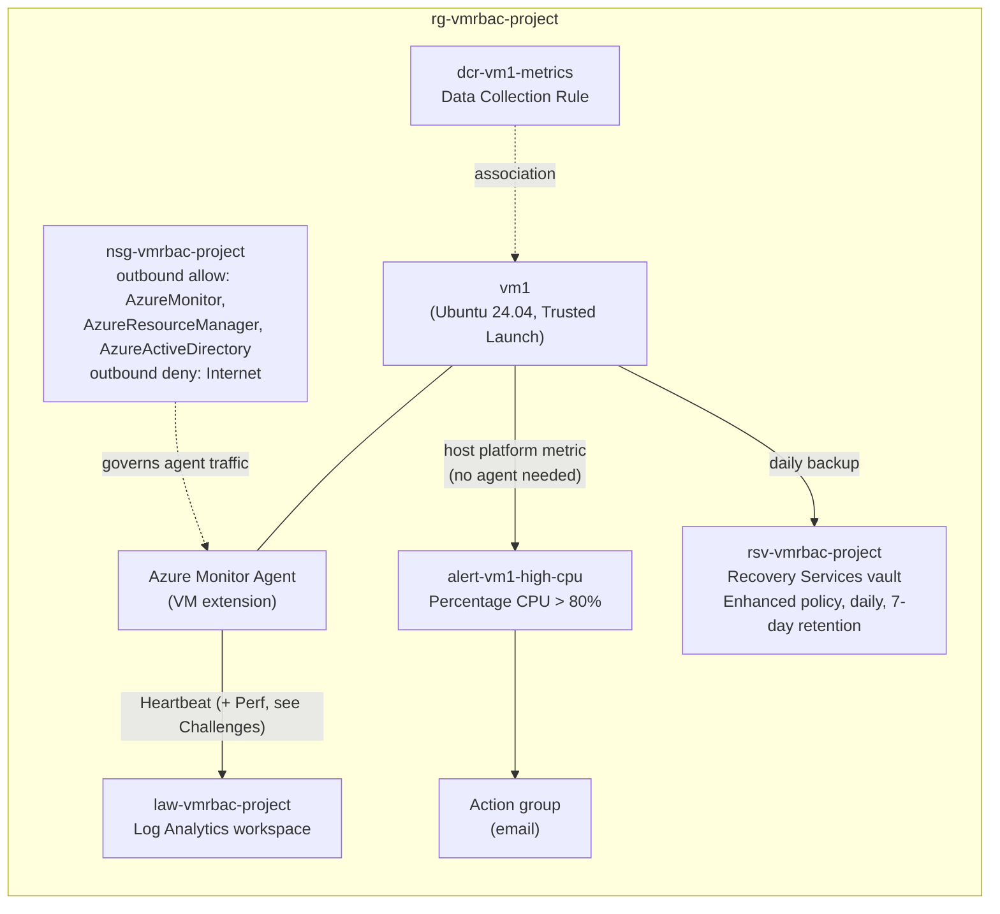

# Monitoring, Backup & Recovery (Project 3 of 6)

Hands-on Azure lab built for AZ-104 (Microsoft Azure Administrator) preparation. It adds monitoring and backup to the VM environment from Projects 1 and 2: a Log Analytics workspace fed by the Azure Monitor Agent through a Data Collection Rule, a host-level CPU alert rule, a KQL query that surfaces an operational signal, and Azure Backup with a Recovery Services vault, a backup policy, and a confirmed restore point. The monitoring resources are defined in Bicep.

> Related repos: [VM-RBAC-Config](https://github.com/dwaynec-cloud/VM-RBAC-Config) (Project 1) · [VNet-Storage-Config](https://github.com/dwaynec-cloud/VNet-Storage-Config) (Project 2) · [Entra-Identity-Config](https://github.com/dwaynec-cloud/Entra-Identity-Config) (Project 4) · [AppService-Config](https://github.com/dwaynec-cloud/AppService-Config) (Project 5) · [Storage-Recovery-Config](https://github.com/dwaynec-cloud/Storage-Recovery-Config) (Project 6)

> **Status:** the lab environment was torn down in October 2026 when the Azure free trial ended. This repo is kept as documentation of the build.

---

## Architecture

Monitoring and backup are separate pipelines protecting the same VM. The Log Analytics workspace stores telemetry, the Recovery Services vault stores backup data, and neither feeds into the other. The CPU alert is a third, independent path: it uses a metric the Azure host collects, so it works even if the agent is down.

- **Log Analytics workspace:** `law-vmrbac-project` (North Central US)
- **Azure Monitor Agent (AMA):** installed on `vm1` as a VM extension, deployed with Bicep
- **Data Collection Rule:** `dcr-vm1-metrics`, collecting the guest counter `\Processor(_Total)\% Processor Time` every 60 seconds into the `Microsoft-Perf` stream, sent to the workspace
- **Data Collection Rule association:** links the DCR to `vm1`
- **CPU alert rule:** `alert-vm1-high-cpu`, a metric alert on the host-level `Percentage CPU` metric (> 80% over a 5-minute window), notifying an action group by email
- **KQL query:** gap detection on the `Heartbeat` table (see [KQL query](#kql-query))
- **Recovery Services vault:** `rsv-vmrbac-project` (North Central US), Enhanced backup policy, daily backup, 7-day retention
- **Infrastructure as Code:** the AMA extension, DCR, DCR association, and alert rule are in `monitoring.bicep`. The vault and backup policy were configured in the Portal

## Key decisions

**Host-level metric alert instead of a guest-level one.** The alert uses `Percentage CPU`, a platform metric the Azure host collects for every VM, rather than the agent's guest counter. The guest pipeline never delivered data (see Challenges), but the host metric is also the usual choice for basic CPU alerting anyway: no agent dependency and nothing to configure inside the VM.

**Enhanced backup policy, not Standard.** `vm1` uses Trusted Launch (Secure Boot and vTPM), which requires the Enhanced policy. The Portal rejected Standard with a validation error tied to the VM's security type.

**File-level restore to test recoverability.** File-level restore avoids creating a second VM, which matters in a cost-limited trial subscription that had already hit VM capacity errors. It stalled (see Challenges), and [Project 6](https://github.com/dwaynec-cloud/Storage-Recovery-Config) later completed a real restore from this vault using Restore disks.

**Backup configured outside Bicep.** The vault and backup policy were set up in the Portal and not codified. Backup infrastructure is often owned and managed separately from workload IaC, so I kept it as a separate manual configuration for this lab.

## Challenges & troubleshooting

**The tag-enforcement policy kept blocking auto-generated resources.** The Portal's VM Insights wizard tried to create a Data Collection Rule without a tag, and `az vm extension set` has no `--tags` flag. Project 1's Deny policy blocked both. The policy uses Indexed mode, which skips only resource types that can't hold tags at all, so it was working as designed. Fixed by writing the extension and the DCR as Bicep resources with explicit tags. The DCR association isn't a taggable resource, so the policy didn't affect it.

**The monitoring agent couldn't reach Azure.** After deployment, no data reached the workspace, not even Heartbeat. The cause was Project 2's `Deny-Outbound-Internet` NSG rule. I worked through it layer by layer:
- `curl` showed the agent's control-plane endpoints were unreachable, so I added outbound allow rules for the `AzureMonitor` and `AzureResourceManager` service tags. Data still didn't flow.
- The agent's own log on the VM (`mdsd.err`) showed repeated failures fetching its configuration.
- A test to `login.microsoftonline.com` also timed out, so the agent couldn't authenticate. A third allow rule for `AzureActiveDirectory` fixed the network path.
- A Data Collection Endpoint turned out not to be needed: DCRs created after March 2024 include their own ingestion endpoints.
- Restarting the `azuremonitoragent` service cleared its retry backoff, and Heartbeat data arrived within minutes.

In hindsight, Microsoft documents the agent's required endpoints. Checking that list before tightening outbound traffic, rather than finding the three service tags one at a time, would have been much faster.

**Guest performance data never arrived.** Heartbeat flowed reliably, but the `Perf` table stayed empty. I checked every layer I could: network access to the three service tags,
